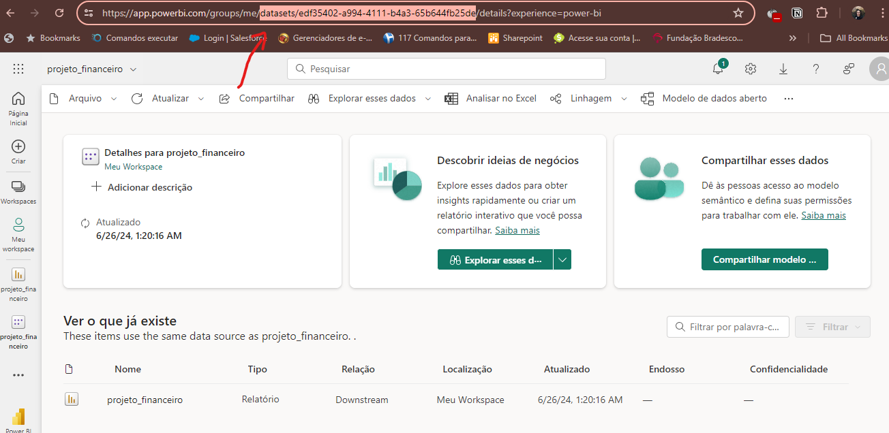
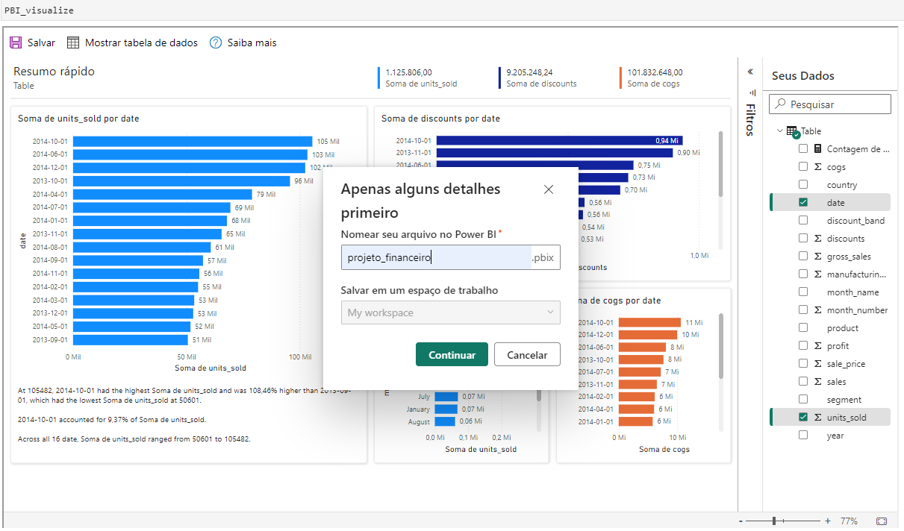
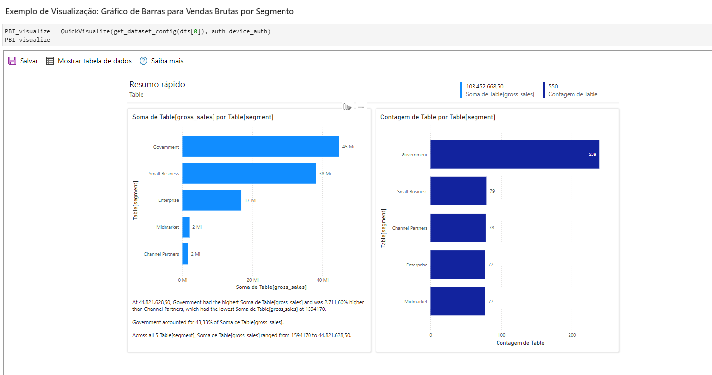
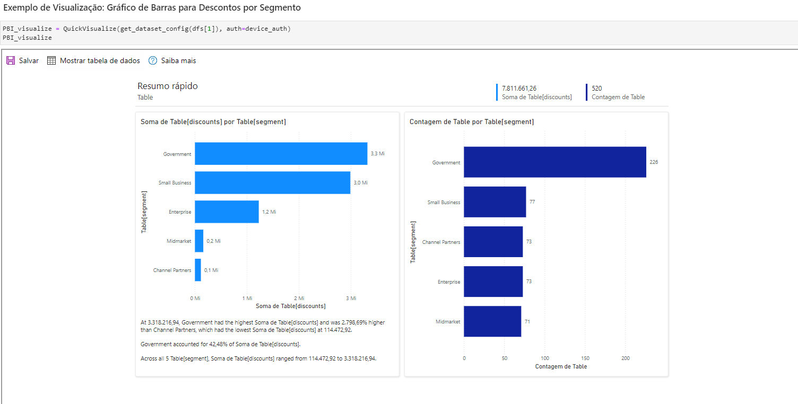
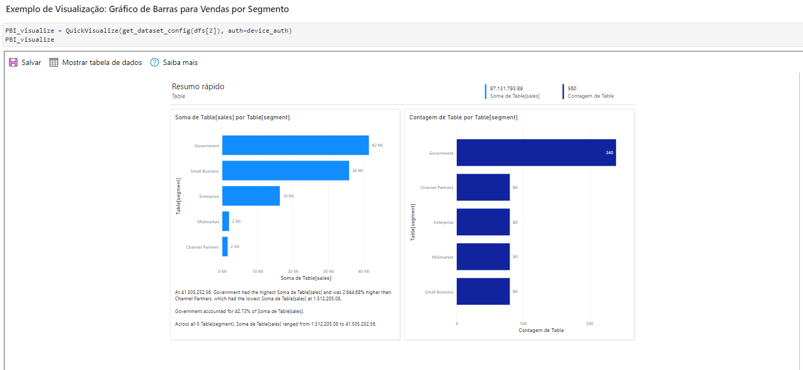
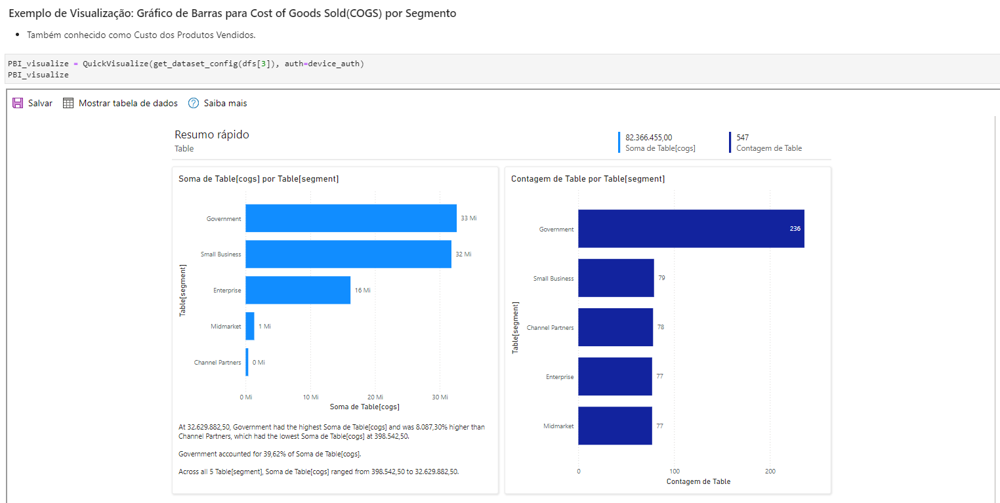
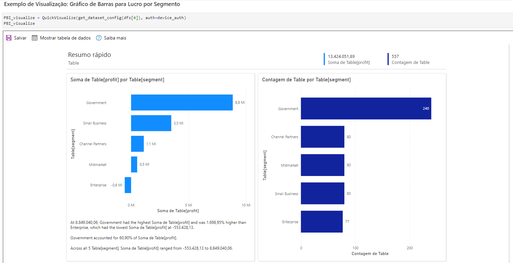
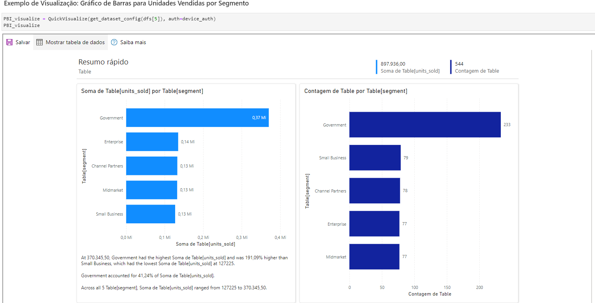
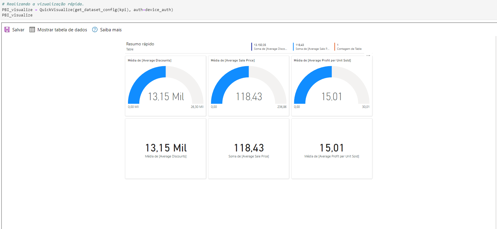

# Integração de APIs e Visualização de Dados no Power BI

### Sobre:

Neste projeto, integramos diversas tecnologias e ferramentas para construir uma análise de KPIs robusta. Utilizamos a plataforma [data.world](https://data.world) para gerenciar nossos dados, aproveitando sua API para facilitar a extração e manipulação das informações. No Jupyter Notebook, usamos a biblioteca `datadotworld` para acessar os dados, juntamente com `powerbicliente` para integrar com Power BI e criar visualizações dinâmicas.

O JupyterLab serviu como o ambiente de desenvolvimento, proporcionando um espaço interativo para codificação e análise.

A implementação desses conceitos e ferramentas não só aprimorou minhas habilidades técnicas como também destacou a importância da integração de diferentes plataformas para uma análise de dados mais eficiente e segura. O conhecimento adquirido é fundamental para profissionais que buscam transformar dados brutos em insights valiosos, otimizando processos de tomada de decisão em diversos contextos empresariais.

## Passo 1: Instalação da Biblioteca

Antes de mergulhar de cabeça na integração, é necessário instalar a biblioteca Power BI para Python. Você pode fazer isso facilmente executando o seguinte comando no seu Jupyter Notebook:


```python
!poetry add powerbiclient
```

## Passo 2: Carregando as Bibliotecas Necessárias

Depois de instalar a biblioteca Power BI, importe as bibliotecas necessárias no seu notebook:


```python
from powerbiclient import QuickVisualize, get_dataset_config, Report
from powerbiclient.authentication import DeviceCodeLoginAuthentication
import pandas as pd
```

## Passo 3: Carregando os Dados

Carregar seus dados é um passo fundamental. Neste exemplo, carregamos um arquivo Excel como um DataFrame:


```python
!poetry add openpyxl -q
```


```python
df = pd.read_excel('Financial Sample.xlsx')  # Certifique-se de que o arquivo esteja no diretório raiz
```

### Visualizando as 5 primeiras linhas do dataframe.


```python
df.head()
```


<div>

<table border="1" class="dataframe">
  <thead>
    <tr style="text-align: right;">
      <th></th>
      <th>Segment</th>
      <th>Country</th>
      <th>Product</th>
      <th>Discount Band</th>
      <th>Units Sold</th>
      <th>Manufacturing Price</th>
      <th>Sale Price</th>
      <th>Gross Sales</th>
      <th>Discounts</th>
      <th>Sales</th>
      <th>COGS</th>
      <th>Profit</th>
      <th>Date</th>
      <th>Month Number</th>
      <th>Month Name</th>
      <th>Year</th>
    </tr>
  </thead>
  <tbody>
    <tr>
      <th>0</th>
      <td>Government</td>
      <td>Canada</td>
      <td>Carretera</td>
      <td>NaN</td>
      <td>1618.5</td>
      <td>3</td>
      <td>20</td>
      <td>32370.0</td>
      <td>0.0</td>
      <td>32370.0</td>
      <td>16185.0</td>
      <td>16185.0</td>
      <td>2014-01-01</td>
      <td>1</td>
      <td>January</td>
      <td>2014</td>
    </tr>
    <tr>
      <th>1</th>
      <td>Government</td>
      <td>Germany</td>
      <td>Carretera</td>
      <td>NaN</td>
      <td>1321.0</td>
      <td>3</td>
      <td>20</td>
      <td>26420.0</td>
      <td>0.0</td>
      <td>26420.0</td>
      <td>13210.0</td>
      <td>13210.0</td>
      <td>2014-01-01</td>
      <td>1</td>
      <td>January</td>
      <td>2014</td>
    </tr>
    <tr>
      <th>2</th>
      <td>Midmarket</td>
      <td>France</td>
      <td>Carretera</td>
      <td>NaN</td>
      <td>2178.0</td>
      <td>3</td>
      <td>15</td>
      <td>32670.0</td>
      <td>0.0</td>
      <td>32670.0</td>
      <td>21780.0</td>
      <td>10890.0</td>
      <td>2014-06-01</td>
      <td>6</td>
      <td>June</td>
      <td>2014</td>
    </tr>
    <tr>
      <th>3</th>
      <td>Midmarket</td>
      <td>Germany</td>
      <td>Carretera</td>
      <td>NaN</td>
      <td>888.0</td>
      <td>3</td>
      <td>15</td>
      <td>13320.0</td>
      <td>0.0</td>
      <td>13320.0</td>
      <td>8880.0</td>
      <td>4440.0</td>
      <td>2014-06-01</td>
      <td>6</td>
      <td>June</td>
      <td>2014</td>
    </tr>
    <tr>
      <th>4</th>
      <td>Midmarket</td>
      <td>Mexico</td>
      <td>Carretera</td>
      <td>NaN</td>
      <td>2470.0</td>
      <td>3</td>
      <td>15</td>
      <td>37050.0</td>
      <td>0.0</td>
      <td>37050.0</td>
      <td>24700.0</td>
      <td>12350.0</td>
      <td>2014-06-01</td>
      <td>6</td>
      <td>June</td>
      <td>2014</td>
    </tr>
  </tbody>
</table>
</div>


## Passo 4: Autenticação com a Conta do Power BI

Para interagir com o Power BI, você precisa autenticar sua conta. Utilizaremos a autenticação com código de dispositivo, o que torna o processo seguro e conveniente:


```python
device_auth = DeviceCodeLoginAuthentication()
```

    Performing device flow authentication. Please follow the instructions below.
    To sign in, use a web browser to open the page https://microsoft.com/devicelogin and enter the code BH7E8WW84 to authenticate.
    
    Device flow authentication successfully completed.
    You are now logged in .
    
    The result should be passed only to trusted code in your notebook.


Siga as instruções para copiar o código gerado e cole-o após acessar o link fornecido. Isso autentica sua conta do Power BI.

## Passo 5: Visualizando seus Dados no Power BI

Agora que seus dados estão prontos e você está autenticado, é hora de criar visualizações no Power BI. O código a seguir faz exatamente isso:


```python
PBI_visualize = QuickVisualize(get_dataset_config(df), auth=device_auth)
```

## Passo 6: Renderizando o Relatório

Agora você pode renderizar o relatório diretamente no Jupyter Notebook:


```python
PBI_visualize
```


```python
# Credenciais do Power BI
group_id="necessário adicionar o group id da sua conta no powerbi online"
report_id="necessário adicionar o id do report desejado"
```


```python
# Instantiate report object with authentication object (e.g DeviceCodeLoginAuthentication)
report = Report(group_id=group_id, report_id=report_id, auth=device_auth)
```

* Em alguns casos podem ocorrer erros ao renderizar o relatório com powerbi, para corrigir isso eu realizei o procedimento abaixo:
# o que eu fiz no terminal .env para que o embed funcionasse corretamente:
$ sudo apt install npm
$ jupyter labextension install @jupyter-widgets/jupyterlab-manager jupyter-matplotlib
# Passos para executar fórmulas DAX no Jupyter Notebook


## 1.Importar as bibliotecas:


```python
# Credenciais do Power BI
# workspace_id = 'seu_workspace_id'  # Substitua pelo seu Workspace ID por defoult ele usa o 'Meu workspace' do powerbi no meu caso usei o default
# group_id = 'seu_group_id'  # Substitua pelo seu Group ID usei o default no meu caso.
report_id = 'seu report_id'  # Substitua pelo seu Report ID
```

## 2. Realizar a autenticação no Power Bi:

* Ao executar a célula abaixo copie o código, no meu caso E9KD24TDQ clique o link e será direcionado para autenticação para colar o mesmo.


```python
device_auth = DeviceCodeLoginAuthentication()

```

    Performing device flow authentication. Please follow the instructions below.
    To sign in, use a web browser to open the page https://microsoft.com/devicelogin and enter the code E9KD24TDQ to authenticate.
    
    Device flow authentication successfully completed.
    You are now logged in .
    
    The result should be passed only to trusted code in your notebook.


## 2. Obter o token de acesso:

*  despois de autenticado basta executar o código abaixo para obter o token, lemando que ele expira e constantemente precisa renovar executando a célula


```python
token = device_auth.get_access_token()
headers = {
    'Content-Type': 'application/json',
    'Authorization': f'Bearer {token}'
}
```

## 3. Enviar as consulta DAX:

* **Defina a URL da consulta:**


```python
dataset_id = 'inserir o seu dataset id'
url = f'https://api.powerbi.com/v1.0/myorg/datasets/{dataset_id}/executeQueries'
```

* **Segue uma imagem com o exemplo de onde obter o dataset_id no site https://app.powerbi.com:**



* **Defina a Consulta DAX:**


```python
dax_query = {
    "queries": [
        {
            "query": "EVALUATE SUMMARIZECOLUMNS('Table'[Product])"
        }
    ],
    "serializerSettings": {
        "includeNulls": True
    }
}

```

* **Envie a Consulta e Obtenho os resultados**: 


```python
response = requests.post(url, headers=headers, json=dax_query)
response_data = response.json()
```

## 4. Processar os resultados:

* **Convertendo o resultado em um DataFrame do Pandas:**


```python
results = response_data['results'][0]['tables'][0]['rows']
df = pd.DataFrame(results)
display(df)
```


<div>

<table border="1" class="dataframe">
  <thead>
    <tr style="text-align: right;">
      <th></th>
      <th>Table[Product]</th>
    </tr>
  </thead>
  <tbody>
    <tr>
      <th>0</th>
      <td>Carretera</td>
    </tr>
    <tr>
      <th>1</th>
      <td>Montana</td>
    </tr>
    <tr>
      <th>2</th>
      <td>Paseo</td>
    </tr>
    <tr>
      <th>3</th>
      <td>Velo</td>
    </tr>
    <tr>
      <th>4</th>
      <td>VTT</td>
    </tr>
    <tr>
      <th>5</th>
      <td>Amarilla</td>
    </tr>
  </tbody>
</table>
</div>


link da documentação:[documentação]('https://learn.microsoft.com/en-us/rest/api/power-bi/datasets/execute-queries') 

# Integração do data.world com python:

## Instalação da biblioteca:


```python
!pip install datadotworld -q
```

## Configuração:

### Esta biblioteca requer um token de autenticação da API data.world para funcionar.
Seu token de autenticação pode ser obtido no data.world depois que você habilitar o [Python em Integrações]('https://data.world/integrations/python')

* **Para configurar a biblioteca, execute o seguinte comando:**

$ dw configure

* Após executar o comando no terminal será solicita o token obtido do sita data.wold

* Alternativamente, os tokens podem ser fornecidos por meio da variável de ambiente DW_AUTH_TOKEN . Em máquinas MacOS ou Unix, execute (substituindo <YOUR_TOKEN>> abaixo pelo token obtido anteriormente):
`export DW_AUTH_TOKEN=<YOUR_TOKEN>`

### Carregar um conjunto de dados


```python
import datadotworld as dw

```


```python
intro_dataset = dw.load_dataset('jcnok/financial-sample')
```


```python
intro_dataset.dataframes
```


    LazyLoadedDict({'financial_sample': LazyLoadedValue(<pandas.DataFrame>)})


* **Você também pode revisar os metadados associados a um arquivo ou ao conjunto de dados inteiro, usando a função describe . Por exemplo:**


```python
intro_dataset.describe()
```


    {'name': 'jcnok_financial-sample',
     'title': 'Financial Sample',
     'description': 'O conjunto de dados "financial sample.xlsx" é um arquivo que contém informações financeiras.\n\n---\n{"editor":"markdown"}\n---\nAqui estão as colunas do conjunto de dados e suas respectivas descrições:\n\n1. **Segment (Segmento)**\n   - Descrição: O segmento de mercado ao qual o produto pertence.\n   \n2. **Country (País)**\n   - Descrição: O país onde a venda foi realizada.\n\n3. **Product (Produto)**\n   - Descrição: O nome do produto vendido.\n\n4. **Discount Band (Banda de Desconto)**\n   - Descrição: Corresponde a classificação do desconto, High(alto), Medium(médio), Low(baixo), None(sem desconto)\n\n5. **Units Sold (Unidades Vendidas)**\n   - Descrição: O número de unidades do produto vendidas.\n\n6. **Manufacturing Price (Preço de Fabricação)**\n   - Descrição: O custo de fabricação de uma unidade do produto.\n\n7. **Sale Price (Preço de Venda)**\n   - Descrição: O preço de venda de uma unidade do produto.\n\n8. **Gross Sales (Vendas Brutas)**\n   - Descrição: A receita bruta gerada pelas vendas (Unidades Vendidas * Preço de Venda).\n\n9. **Discounts (Descontos)**\n   - Descrição: O valor total de descontos aplicados às vendas.\n\n10. **Sales (Vendas)**\n    - Descrição: A receita líquida gerada pelas vendas (Vendas Brutas - Descontos).\n\n11. **COGS (Custo dos Produtos Vendidos)**\n    - Descrição: O custo dos produtos vendidos, é o custo total de fabricação ou compra de um produto que uma empresa vende. Inclui o custo dos materiais, mão de obra e outras despesas diretamente relacionadas à produção do produto.\n\n12. **Profit (Lucro)**\n    - Descrição: O lucro gerado pelas vendas (Vendas - Custo dos Bens Vendidos).\n\n13. **Date (Data)**\n    - Descrição: A data em que a venda foi realizada.\n    \n14. **Month Number (Mês em Número)**\n    - Descrição: Mês em número em que a venda foi realizada.\n    \n15. **Month Name (Mês)**\n    - Descrição: Mês em que a venda foi realizada.\n\n16. **Year (Ano)**\n    - Descrição: Ano em que a venda foi realizada.',
     'homepage': 'https://data.world/jcnok/financial-sample',
     'resources': [{'name': 'financial_sample',
       'path': 'data/financial_sample.csv',
       'format': 'csv',
       'profile': 'data-resource'},
      {'name': 'original/Financial Sample.xlsx',
       'path': 'original/Financial Sample.xlsx',
       'format': 'xlsx',
       'mediatype': 'application/vnd.openxmlformats-officedocument.spreadsheetml.sheet',
       'bytes': 83418,
       'profile': 'data-resource'}],
     'profile': 'data-package'}


### Consultar um conjunto de dados:

* A função query() permite que conjuntos de dados sejam consultados ao vivo usando linguagens de consulta SQL ou SPARQL .

* Para consultar um conjunto de dados, invoque a função query() . Por exemplo:


```python
results = dw.query('jcnok/financial-sample', 'SELECT * FROM financial_sample')
```


```python
results.dataframe
```


<div>

<table border="1" class="dataframe">
  <thead>
    <tr style="text-align: right;">
      <th></th>
      <th>segment</th>
      <th>country</th>
      <th>product</th>
      <th>discount_band</th>
      <th>units_sold</th>
      <th>manufacturing_price</th>
      <th>sale_price</th>
      <th>gross_sales</th>
      <th>discounts</th>
      <th>sales</th>
      <th>cogs</th>
      <th>profit</th>
      <th>date</th>
      <th>month_number</th>
      <th>month_name</th>
      <th>year</th>
    </tr>
  </thead>
  <tbody>
    <tr>
      <th>0</th>
      <td>Government</td>
      <td>Canada</td>
      <td>Carretera</td>
      <td>None</td>
      <td>1618.5</td>
      <td>3</td>
      <td>20</td>
      <td>32370.0</td>
      <td>0.00</td>
      <td>32370.00</td>
      <td>16185.0</td>
      <td>16185.00</td>
      <td>2014-01-01</td>
      <td>1</td>
      <td>January</td>
      <td>2014</td>
    </tr>
    <tr>
      <th>1</th>
      <td>Government</td>
      <td>Germany</td>
      <td>Carretera</td>
      <td>None</td>
      <td>1321.0</td>
      <td>3</td>
      <td>20</td>
      <td>26420.0</td>
      <td>0.00</td>
      <td>26420.00</td>
      <td>13210.0</td>
      <td>13210.00</td>
      <td>2014-01-01</td>
      <td>1</td>
      <td>January</td>
      <td>2014</td>
    </tr>
    <tr>
      <th>2</th>
      <td>Midmarket</td>
      <td>France</td>
      <td>Carretera</td>
      <td>None</td>
      <td>2178.0</td>
      <td>3</td>
      <td>15</td>
      <td>32670.0</td>
      <td>0.00</td>
      <td>32670.00</td>
      <td>21780.0</td>
      <td>10890.00</td>
      <td>2014-06-01</td>
      <td>6</td>
      <td>June</td>
      <td>2014</td>
    </tr>
    <tr>
      <th>3</th>
      <td>Midmarket</td>
      <td>Germany</td>
      <td>Carretera</td>
      <td>None</td>
      <td>888.0</td>
      <td>3</td>
      <td>15</td>
      <td>13320.0</td>
      <td>0.00</td>
      <td>13320.00</td>
      <td>8880.0</td>
      <td>4440.00</td>
      <td>2014-06-01</td>
      <td>6</td>
      <td>June</td>
      <td>2014</td>
    </tr>
    <tr>
      <th>4</th>
      <td>Midmarket</td>
      <td>Mexico</td>
      <td>Carretera</td>
      <td>None</td>
      <td>2470.0</td>
      <td>3</td>
      <td>15</td>
      <td>37050.0</td>
      <td>0.00</td>
      <td>37050.00</td>
      <td>24700.0</td>
      <td>12350.00</td>
      <td>2014-06-01</td>
      <td>6</td>
      <td>June</td>
      <td>2014</td>
    </tr>
    <tr>
      <th>...</th>
      <td>...</td>
      <td>...</td>
      <td>...</td>
      <td>...</td>
      <td>...</td>
      <td>...</td>
      <td>...</td>
      <td>...</td>
      <td>...</td>
      <td>...</td>
      <td>...</td>
      <td>...</td>
      <td>...</td>
      <td>...</td>
      <td>...</td>
      <td>...</td>
    </tr>
    <tr>
      <th>695</th>
      <td>Small Business</td>
      <td>France</td>
      <td>Amarilla</td>
      <td>High</td>
      <td>2475.0</td>
      <td>260</td>
      <td>300</td>
      <td>742500.0</td>
      <td>111375.00</td>
      <td>631125.00</td>
      <td>618750.0</td>
      <td>12375.00</td>
      <td>2014-03-01</td>
      <td>3</td>
      <td>March</td>
      <td>2014</td>
    </tr>
    <tr>
      <th>696</th>
      <td>Small Business</td>
      <td>Mexico</td>
      <td>Amarilla</td>
      <td>High</td>
      <td>546.0</td>
      <td>260</td>
      <td>300</td>
      <td>163800.0</td>
      <td>24570.00</td>
      <td>139230.00</td>
      <td>136500.0</td>
      <td>2730.00</td>
      <td>2014-10-01</td>
      <td>10</td>
      <td>October</td>
      <td>2014</td>
    </tr>
    <tr>
      <th>697</th>
      <td>Government</td>
      <td>Mexico</td>
      <td>Montana</td>
      <td>High</td>
      <td>1368.0</td>
      <td>5</td>
      <td>7</td>
      <td>9576.0</td>
      <td>1436.40</td>
      <td>8139.60</td>
      <td>6840.0</td>
      <td>1299.60</td>
      <td>2014-02-01</td>
      <td>2</td>
      <td>February</td>
      <td>2014</td>
    </tr>
    <tr>
      <th>698</th>
      <td>Government</td>
      <td>Canada</td>
      <td>Paseo</td>
      <td>High</td>
      <td>723.0</td>
      <td>10</td>
      <td>7</td>
      <td>5061.0</td>
      <td>759.15</td>
      <td>4301.85</td>
      <td>3615.0</td>
      <td>686.85</td>
      <td>2014-04-01</td>
      <td>4</td>
      <td>April</td>
      <td>2014</td>
    </tr>
    <tr>
      <th>699</th>
      <td>Channel Partners</td>
      <td>United States of America</td>
      <td>VTT</td>
      <td>High</td>
      <td>1806.0</td>
      <td>250</td>
      <td>12</td>
      <td>21672.0</td>
      <td>3250.80</td>
      <td>18421.20</td>
      <td>5418.0</td>
      <td>13003.20</td>
      <td>2014-05-01</td>
      <td>5</td>
      <td>May</td>
      <td>2014</td>
    </tr>
  </tbody>
</table>
<p>700 rows × 16 columns</p>
</div>


Link para criar a conta: [data.world]('https://data.world/')
Link para obter o token: [token api datadotworld]('https://data.world/integrations/python')
Documentação da API: [Datadotworld]('https://pypi.org/project/datadotworld/')

# Passos para integrar data.world com Power BI no Jupyter Notebook


## 1. Configurar a API do data.world:

* Primeiro, você precisará de um token de API do data.world. Você pode obter isso acessando sua conta no data.world e navegando até as configurações de API.
* Em seguida, defina seu token de API:

## 2. Importar as bibliotecas necessárias:


```python
import requests
import pandas as pd
from powerbiclient.authentication import DeviceCodeLoginAuthentication
from powerbiclient import Report, models

```

## 3. Autenticar no Power BI:


```python
device_auth = DeviceCodeLoginAuthentication()

```

    Performing device flow authentication. Please follow the instructions below.
    To sign in, use a web browser to open the page https://microsoft.com/devicelogin and enter the code FXYFJJTCF to authenticate.
    
    Device flow authentication successfully completed.
    You are now logged in .
    
    The result should be passed only to trusted code in your notebook.


## 4. Obter dados do data.world:


### Conhecendo o dataset:


```python
DW_API_TOKEN = <seu token>
```


```python
import requests

url = "https://api.data.world/v0/datasets/jcnok/financial-sample"

headers = {
    "accept": "application/json",
    "authorization": f"Bearer {DW_API_TOKEN}"
}

response = requests.get(url, headers=headers)

print(response.json()['summary'])
```

    ---
    {"editor":"markdown"}
    ---
    Aqui estão as colunas do conjunto de dados e suas respectivas descrições:
    
    1. **Segment (Segmento)**
       - Descrição: O segmento de mercado ao qual o produto pertence.
       
    2. **Country (País)**
       - Descrição: O país onde a venda foi realizada.
    
    3. **Product (Produto)**
       - Descrição: O nome do produto vendido.
    
    4. **Discount Band (Banda de Desconto)**
       - Descrição: Corresponde a classificação do desconto, High(alto), Medium(médio), Low(baixo), None(sem desconto)
    
    5. **Units Sold (Unidades Vendidas)**
       - Descrição: O número de unidades do produto vendidas.
    
    6. **Manufacturing Price (Preço de Fabricação)**
       - Descrição: O custo de fabricação de uma unidade do produto.
    
    7. **Sale Price (Preço de Venda)**
       - Descrição: O preço de venda de uma unidade do produto.
    
    8. **Gross Sales (Vendas Brutas)**
       - Descrição: A receita bruta gerada pelas vendas (Unidades Vendidas * Preço de Venda).
    
    9. **Discounts (Descontos)**
       - Descrição: O valor total de descontos aplicados às vendas.
    
    10. **Sales (Vendas)**
        - Descrição: A receita líquida gerada pelas vendas (Vendas Brutas - Descontos).
    
    11. **COGS (Custo dos Produtos Vendidos)**
        - Descrição: O custo dos produtos vendidos, é o custo total de fabricação ou compra de um produto que uma empresa vende. Inclui o custo dos materiais, mão de obra e outras despesas diretamente relacionadas à produção do produto.
    
    12. **Profit (Lucro)**
        - Descrição: O lucro gerado pelas vendas (Vendas - Custo dos Bens Vendidos).
    
    13. **Date (Data)**
        - Descrição: A data em que a venda foi realizada.
        
    14. **Month Number (Mês em Número)**
        - Descrição: Mês em número em que a venda foi realizada.
        
    15. **Month Name (Mês)**
        - Descrição: Mês em que a venda foi realizada.
    
    16. **Year (Ano)**
        - Descrição: Ano em que a venda foi realizada.
        
    


* Defina a URL e os cabeçalhos da solicitação:


```python
url = "https://api.data.world/v0/sql/jcnok/financial-sample?dialect=DW_SQL"
headers = {
    "accept": "application/json",
    "content-type": "application/json",
    "authorization": f'Bearer {DW_API_TOKEN}'
}
```

* Defina a consulta SQL que deseja executar:


```python
query = {'query':'SELECT * FROM financial_sample'}
```

* Envie a solicitação e obtenha os resultados:


```python
response = requests.post(url, json=payload, headers=headers)

data = response.json()
df = pd.json_normalize(data)
display(df)
```


<div>

<table border="1" class="dataframe">
  <thead>
    <tr style="text-align: right;">
      <th></th>
      <th>segment</th>
      <th>country</th>
      <th>product</th>
      <th>discount_band</th>
      <th>units_sold</th>
      <th>manufacturing_price</th>
      <th>sale_price</th>
      <th>gross_sales</th>
      <th>discounts</th>
      <th>sales</th>
      <th>cogs</th>
      <th>profit</th>
      <th>date</th>
      <th>month_number</th>
      <th>month_name</th>
      <th>year</th>
    </tr>
  </thead>
  <tbody>
    <tr>
      <th>0</th>
      <td>Government</td>
      <td>Canada</td>
      <td>Carretera</td>
      <td>None</td>
      <td>1618.5</td>
      <td>3</td>
      <td>20</td>
      <td>32370.0</td>
      <td>0.00</td>
      <td>32370.00</td>
      <td>16185.0</td>
      <td>16185.00</td>
      <td>2014-01-01</td>
      <td>1</td>
      <td>January</td>
      <td>2014</td>
    </tr>
    <tr>
      <th>1</th>
      <td>Government</td>
      <td>Germany</td>
      <td>Carretera</td>
      <td>None</td>
      <td>1321.0</td>
      <td>3</td>
      <td>20</td>
      <td>26420.0</td>
      <td>0.00</td>
      <td>26420.00</td>
      <td>13210.0</td>
      <td>13210.00</td>
      <td>2014-01-01</td>
      <td>1</td>
      <td>January</td>
      <td>2014</td>
    </tr>
    <tr>
      <th>2</th>
      <td>Midmarket</td>
      <td>France</td>
      <td>Carretera</td>
      <td>None</td>
      <td>2178.0</td>
      <td>3</td>
      <td>15</td>
      <td>32670.0</td>
      <td>0.00</td>
      <td>32670.00</td>
      <td>21780.0</td>
      <td>10890.00</td>
      <td>2014-06-01</td>
      <td>6</td>
      <td>June</td>
      <td>2014</td>
    </tr>
    <tr>
      <th>3</th>
      <td>Channel Partners</td>
      <td>Canada</td>
      <td>Montana</td>
      <td>None</td>
      <td>2518.0</td>
      <td>5</td>
      <td>12</td>
      <td>30216.0</td>
      <td>0.00</td>
      <td>30216.00</td>
      <td>7554.0</td>
      <td>22662.00</td>
      <td>2014-06-01</td>
      <td>6</td>
      <td>June</td>
      <td>2014</td>
    </tr>
    <tr>
      <th>4</th>
      <td>Government</td>
      <td>France</td>
      <td>Montana</td>
      <td>None</td>
      <td>1899.0</td>
      <td>5</td>
      <td>20</td>
      <td>37980.0</td>
      <td>0.00</td>
      <td>37980.00</td>
      <td>18990.0</td>
      <td>18990.00</td>
      <td>2014-06-01</td>
      <td>6</td>
      <td>June</td>
      <td>2014</td>
    </tr>
    <tr>
      <th>...</th>
      <td>...</td>
      <td>...</td>
      <td>...</td>
      <td>...</td>
      <td>...</td>
      <td>...</td>
      <td>...</td>
      <td>...</td>
      <td>...</td>
      <td>...</td>
      <td>...</td>
      <td>...</td>
      <td>...</td>
      <td>...</td>
      <td>...</td>
      <td>...</td>
    </tr>
    <tr>
      <th>695</th>
      <td>Enterprise</td>
      <td>France</td>
      <td>Carretera</td>
      <td>High</td>
      <td>2441.0</td>
      <td>3</td>
      <td>125</td>
      <td>305125.0</td>
      <td>33563.75</td>
      <td>271561.25</td>
      <td>292920.0</td>
      <td>-21358.75</td>
      <td>2014-10-01</td>
      <td>10</td>
      <td>October</td>
      <td>2014</td>
    </tr>
    <tr>
      <th>696</th>
      <td>Midmarket</td>
      <td>Canada</td>
      <td>Carretera</td>
      <td>High</td>
      <td>1560.0</td>
      <td>3</td>
      <td>15</td>
      <td>23400.0</td>
      <td>2574.00</td>
      <td>20826.00</td>
      <td>15600.0</td>
      <td>5226.00</td>
      <td>2013-11-01</td>
      <td>11</td>
      <td>November</td>
      <td>2013</td>
    </tr>
    <tr>
      <th>697</th>
      <td>Government</td>
      <td>Mexico</td>
      <td>Carretera</td>
      <td>High</td>
      <td>2706.0</td>
      <td>3</td>
      <td>7</td>
      <td>18942.0</td>
      <td>2083.62</td>
      <td>16858.38</td>
      <td>13530.0</td>
      <td>3328.38</td>
      <td>2013-11-01</td>
      <td>11</td>
      <td>November</td>
      <td>2013</td>
    </tr>
    <tr>
      <th>698</th>
      <td>Government</td>
      <td>Germany</td>
      <td>Montana</td>
      <td>High</td>
      <td>766.0</td>
      <td>5</td>
      <td>350</td>
      <td>268100.0</td>
      <td>29491.00</td>
      <td>238609.00</td>
      <td>199160.0</td>
      <td>39449.00</td>
      <td>2014-01-01</td>
      <td>1</td>
      <td>January</td>
      <td>2014</td>
    </tr>
    <tr>
      <th>699</th>
      <td>Government</td>
      <td>Germany</td>
      <td>Montana</td>
      <td>High</td>
      <td>2992.0</td>
      <td>5</td>
      <td>20</td>
      <td>59840.0</td>
      <td>6582.40</td>
      <td>53257.60</td>
      <td>29920.0</td>
      <td>23337.60</td>
      <td>2013-10-01</td>
      <td>10</td>
      <td>October</td>
      <td>2013</td>
    </tr>
  </tbody>
</table>
<p>700 rows × 16 columns</p>
</div>


## 5. Incorporar o dataframe no Power BI:

* **Carregando as bibliotecas:**


```python
from powerbiclient import QuickVisualize, get_dataset_config, Report
from powerbiclient.authentication import DeviceCodeLoginAuthentication
import pandas as pd
```

* **Criando uma visualização de forma automática com o QuickVisualize**:


```python
PBI_visualize = QuickVisualize(get_dataset_config(df), auth=device_auth)
PBI_visualize
```



* **Clique no ícone de salvar para salver o dash no powerbi online:**


```python
PBI_visualize
```


## Enviar as consulta DAX:

* **Obtendo o token de acesso:**


```python
token = device_auth.get_access_token()
headers = {
    'Content-Type': 'application/json',
    'Authorization': f'Bearer {token}'
}
```

* **Defina a URL da consulta:**


```python
dataset_id = 'edf35402-a994-4111-b4a3-65b644fb25de'
url = f'https://api.powerbi.com/v1.0/myorg/datasets/{dataset_id}/executeQueries'
```

* **Defina a Consulta DAX:**


```python
dax_query = {
    "queries": [
        {
            "query": "EVALUATE SUMMARIZECOLUMNS('Table'[Product])"
        }
    ],
    "serializerSettings": {
        "includeNulls": True
    }
}

```

* **Envie a Consulta e Obtenho os resultados**: 


```python
response = requests.post(url, headers=headers, json=dax_query)
response_data = response.json()
```

* **Convertendo o resultado em um DataFrame do Pandas:**


```python
results = response_data['results'][0]['tables'][0]['rows']
df = pd.DataFrame(results)
display(df)
```


<div>

<table border="1" class="dataframe">
  <thead>
    <tr style="text-align: right;">
      <th></th>
      <th>Table[product]</th>
    </tr>
  </thead>
  <tbody>
    <tr>
      <th>0</th>
      <td>Carretera</td>
    </tr>
    <tr>
      <th>1</th>
      <td>Montana</td>
    </tr>
    <tr>
      <th>2</th>
      <td>Paseo</td>
    </tr>
    <tr>
      <th>3</th>
      <td>Velo</td>
    </tr>
    <tr>
      <th>4</th>
      <td>VTT</td>
    </tr>
    <tr>
      <th>5</th>
      <td>Amarilla</td>
    </tr>
  </tbody>
</table>
</div>


link da documentação:[documentação]('https://learn.microsoft.com/en-us/rest/api/power-bi/datasets/execute-queries') 


```python
dax_query = {
    "queries": [
        {
            "query": "EVALUATE CALCULATE(AVERAGE('Table'[Discounts]))"
        }
    ],
    "serializerSettings": {
        "includeNulls": True
    }
}
```


```python
response = requests.post(url, headers=headers, json=dax_query)
response_data = response.json()
#results = response_data['results'][0]['tables'][0]['rows']
response_data
#df = pd.DataFrame(results)
#display(df)
```


    {'error': {'code': 'DatasetExecuteQueriesError',
      'pbi.error': {'code': 'DatasetExecuteQueriesError',
       'parameters': {},
       'details': [{'code': 'DetailsMessage',
         'detail': {'type': 1,
          'value': 'Query (1, 1) The expression specified in the query is not a valid table expression.'}},
        {'code': 'AnalysisServicesErrorCode',
         'detail': {'type': 1, 'value': '3241803862'}}]}}}


EVALUATE CALCULATETABLE(ADDCOLUMNS(financials, "media", AVERAGE(financials[ Sales])))

```python
# Lista de consultas DAX
dax_queries = [
    {"query": "EVALUATE CALCULATETABLE(SUMMARIZE('Table', 'Table'[Segment], 'Table'[Gross_Sales]), ALLEXCEPT('Table', 'Table'[Segment]))"},
    {"query": "EVALUATE CALCULATETABLE(SUMMARIZE('Table', 'Table'[Segment], 'Table'[Discounts]), ALLEXCEPT('Table', 'Table'[Segment]))"},
    {"query": "EVALUATE CALCULATETABLE(SUMMARIZE('Table', 'Table'[Segment], 'Table'[Sales]), ALLEXCEPT('Table', 'Table'[Segment]))"},
    {"query": "EVALUATE CALCULATETABLE(SUMMARIZE('Table', 'Table'[Segment], 'Table'[COGS]), ALLEXCEPT('Table', 'Table'[Segment]))"},
    {"query": "EVALUATE CALCULATETABLE(SUMMARIZE('Table', 'Table'[Segment], 'Table'[Profit]), ALLEXCEPT('Table', 'Table'[Segment]))"},
    {"query": "EVALUATE CALCULATETABLE(SUMMARIZE('Table', 'Table'[Segment], 'Table'[Units_Sold]), ALLEXCEPT('Table', 'Table'[Segment]))"},
    {"query": "EVALUATE ROW(\"Average Sale Price\", CALCULATE(AVERAGE('Table'[Sale_Price])))"},
    {"query": "EVALUATE ROW(\"Average Profit per Unit Sold\", CALCULATE(AVERAGE('Table'[Profit]) / AVERAGE('Table'[Units_Sold])))"},
    {"query": "EVALUATE ROW(\"Average Discounts\", CALCULATE(AVERAGE('Table'[Discounts])))"},
    {"query": "EVALUATE SUMMARIZECOLUMNS('Table'[Segment], 'Table'[Sales])"}
]

# Função para executar consultas DAX e retornar DataFrame
def execute_dax_query(dax_query, headers, url):
    response = requests.post(url, headers=headers, json={"queries": [dax_query], "serializerSettings": {"includeNulls": True}})
    response_data = response.json()
    results = response_data['results'][0]['tables'][0]['rows']
    df = pd.DataFrame(results)
    return df

# Executar consultas e exibir resultados
for dax_query in dax_queries:
    df = execute_dax_query(dax_query, headers, url)
    display(df)

```


<div>

<table border="1" class="dataframe">
  <thead>
    <tr style="text-align: right;">
      <th></th>
      <th>Table[segment]</th>
      <th>Table[gross_sales]</th>
    </tr>
  </thead>
  <tbody>
    <tr>
      <th>0</th>
      <td>Government</td>
      <td>15022.0</td>
    </tr>
    <tr>
      <th>1</th>
      <td>Government</td>
      <td>6181.0</td>
    </tr>
    <tr>
      <th>2</th>
      <td>Government</td>
      <td>8001.0</td>
    </tr>
    <tr>
      <th>3</th>
      <td>Government</td>
      <td>10451.0</td>
    </tr>
    <tr>
      <th>4</th>
      <td>Government</td>
      <td>11802.0</td>
    </tr>
    <tr>
      <th>...</th>
      <td>...</td>
      <td>...</td>
    </tr>
    <tr>
      <th>545</th>
      <td>Small Business</td>
      <td>769500.0</td>
    </tr>
    <tr>
      <th>546</th>
      <td>Midmarket</td>
      <td>55125.0</td>
    </tr>
    <tr>
      <th>547</th>
      <td>Small Business</td>
      <td>397200.0</td>
    </tr>
    <tr>
      <th>548</th>
      <td>Channel Partners</td>
      <td>21300.0</td>
    </tr>
    <tr>
      <th>549</th>
      <td>Small Business</td>
      <td>177300.0</td>
    </tr>
  </tbody>
</table>
<p>550 rows × 2 columns</p>
</div>


<div>

<table border="1" class="dataframe">
  <thead>
    <tr style="text-align: right;">
      <th></th>
      <th>Table[segment]</th>
      <th>Table[discounts]</th>
    </tr>
  </thead>
  <tbody>
    <tr>
      <th>0</th>
      <td>Government</td>
      <td>0.00</td>
    </tr>
    <tr>
      <th>1</th>
      <td>Midmarket</td>
      <td>0.00</td>
    </tr>
    <tr>
      <th>2</th>
      <td>Channel Partners</td>
      <td>0.00</td>
    </tr>
    <tr>
      <th>3</th>
      <td>Enterprise</td>
      <td>0.00</td>
    </tr>
    <tr>
      <th>4</th>
      <td>Small Business</td>
      <td>0.00</td>
    </tr>
    <tr>
      <th>...</th>
      <td>...</td>
      <td>...</td>
    </tr>
    <tr>
      <th>515</th>
      <td>Government</td>
      <td>30492.00</td>
    </tr>
    <tr>
      <th>516</th>
      <td>Small Business</td>
      <td>92763.00</td>
    </tr>
    <tr>
      <th>517</th>
      <td>Midmarket</td>
      <td>2574.00</td>
    </tr>
    <tr>
      <th>518</th>
      <td>Government</td>
      <td>2083.62</td>
    </tr>
    <tr>
      <th>519</th>
      <td>Government</td>
      <td>29491.00</td>
    </tr>
  </tbody>
</table>
<p>520 rows × 2 columns</p>
</div>


<div>

<table border="1" class="dataframe">
  <thead>
    <tr style="text-align: right;">
      <th></th>
      <th>Table[segment]</th>
      <th>Table[sales]</th>
    </tr>
  </thead>
  <tbody>
    <tr>
      <th>0</th>
      <td>Government</td>
      <td>32370.00</td>
    </tr>
    <tr>
      <th>1</th>
      <td>Government</td>
      <td>26420.00</td>
    </tr>
    <tr>
      <th>2</th>
      <td>Midmarket</td>
      <td>32670.00</td>
    </tr>
    <tr>
      <th>3</th>
      <td>Channel Partners</td>
      <td>30216.00</td>
    </tr>
    <tr>
      <th>4</th>
      <td>Government</td>
      <td>37980.00</td>
    </tr>
    <tr>
      <th>...</th>
      <td>...</td>
      <td>...</td>
    </tr>
    <tr>
      <th>555</th>
      <td>Government</td>
      <td>246708.00</td>
    </tr>
    <tr>
      <th>556</th>
      <td>Small Business</td>
      <td>750537.00</td>
    </tr>
    <tr>
      <th>557</th>
      <td>Midmarket</td>
      <td>20826.00</td>
    </tr>
    <tr>
      <th>558</th>
      <td>Government</td>
      <td>16858.38</td>
    </tr>
    <tr>
      <th>559</th>
      <td>Government</td>
      <td>238609.00</td>
    </tr>
  </tbody>
</table>
<p>560 rows × 2 columns</p>
</div>


<div>

<table border="1" class="dataframe">
  <thead>
    <tr style="text-align: right;">
      <th></th>
      <th>Table[segment]</th>
      <th>Table[cogs]</th>
    </tr>
  </thead>
  <tbody>
    <tr>
      <th>0</th>
      <td>Government</td>
      <td>10730.0</td>
    </tr>
    <tr>
      <th>1</th>
      <td>Government</td>
      <td>4415.0</td>
    </tr>
    <tr>
      <th>2</th>
      <td>Government</td>
      <td>5715.0</td>
    </tr>
    <tr>
      <th>3</th>
      <td>Government</td>
      <td>7465.0</td>
    </tr>
    <tr>
      <th>4</th>
      <td>Government</td>
      <td>8430.0</td>
    </tr>
    <tr>
      <th>...</th>
      <td>...</td>
      <td>...</td>
    </tr>
    <tr>
      <th>542</th>
      <td>Small Business</td>
      <td>641250.0</td>
    </tr>
    <tr>
      <th>543</th>
      <td>Midmarket</td>
      <td>36750.0</td>
    </tr>
    <tr>
      <th>544</th>
      <td>Small Business</td>
      <td>331000.0</td>
    </tr>
    <tr>
      <th>545</th>
      <td>Channel Partners</td>
      <td>5325.0</td>
    </tr>
    <tr>
      <th>546</th>
      <td>Small Business</td>
      <td>147750.0</td>
    </tr>
  </tbody>
</table>
<p>547 rows × 2 columns</p>
</div>


<div>

<table border="1" class="dataframe">
  <thead>
    <tr style="text-align: right;">
      <th></th>
      <th>Table[segment]</th>
      <th>Table[profit]</th>
    </tr>
  </thead>
  <tbody>
    <tr>
      <th>0</th>
      <td>Government</td>
      <td>16185.00</td>
    </tr>
    <tr>
      <th>1</th>
      <td>Government</td>
      <td>13210.00</td>
    </tr>
    <tr>
      <th>2</th>
      <td>Midmarket</td>
      <td>10890.00</td>
    </tr>
    <tr>
      <th>3</th>
      <td>Channel Partners</td>
      <td>22662.00</td>
    </tr>
    <tr>
      <th>4</th>
      <td>Government</td>
      <td>18990.00</td>
    </tr>
    <tr>
      <th>...</th>
      <td>...</td>
      <td>...</td>
    </tr>
    <tr>
      <th>552</th>
      <td>Government</td>
      <td>40788.00</td>
    </tr>
    <tr>
      <th>553</th>
      <td>Small Business</td>
      <td>47787.00</td>
    </tr>
    <tr>
      <th>554</th>
      <td>Midmarket</td>
      <td>5226.00</td>
    </tr>
    <tr>
      <th>555</th>
      <td>Government</td>
      <td>3328.38</td>
    </tr>
    <tr>
      <th>556</th>
      <td>Government</td>
      <td>39449.00</td>
    </tr>
  </tbody>
</table>
<p>557 rows × 2 columns</p>
</div>


<div>

<table border="1" class="dataframe">
  <thead>
    <tr style="text-align: right;">
      <th></th>
      <th>Table[segment]</th>
      <th>Table[units_sold]</th>
    </tr>
  </thead>
  <tbody>
    <tr>
      <th>0</th>
      <td>Government</td>
      <td>2146.0</td>
    </tr>
    <tr>
      <th>1</th>
      <td>Government</td>
      <td>883.0</td>
    </tr>
    <tr>
      <th>2</th>
      <td>Government</td>
      <td>1143.0</td>
    </tr>
    <tr>
      <th>3</th>
      <td>Government</td>
      <td>1493.0</td>
    </tr>
    <tr>
      <th>4</th>
      <td>Government</td>
      <td>1686.0</td>
    </tr>
    <tr>
      <th>...</th>
      <td>...</td>
      <td>...</td>
    </tr>
    <tr>
      <th>539</th>
      <td>Small Business</td>
      <td>2565.0</td>
    </tr>
    <tr>
      <th>540</th>
      <td>Midmarket</td>
      <td>3675.0</td>
    </tr>
    <tr>
      <th>541</th>
      <td>Small Business</td>
      <td>1324.0</td>
    </tr>
    <tr>
      <th>542</th>
      <td>Channel Partners</td>
      <td>1775.0</td>
    </tr>
    <tr>
      <th>543</th>
      <td>Small Business</td>
      <td>591.0</td>
    </tr>
  </tbody>
</table>
<p>544 rows × 2 columns</p>
</div>


<div>

<table border="1" class="dataframe">
  <thead>
    <tr style="text-align: right;">
      <th></th>
      <th>[Average Sale Price]</th>
    </tr>
  </thead>
  <tbody>
    <tr>
      <th>0</th>
      <td>118.428571</td>
    </tr>
  </tbody>
</table>
</div>


<div>

<table border="1" class="dataframe">
  <thead>
    <tr style="text-align: right;">
      <th></th>
      <th>[Average Profit per Unit Sold]</th>
    </tr>
  </thead>
  <tbody>
    <tr>
      <th>0</th>
      <td>15.005873</td>
    </tr>
  </tbody>
</table>
</div>


<div>

<table border="1" class="dataframe">
  <thead>
    <tr style="text-align: right;">
      <th></th>
      <th>[Average Discounts]</th>
    </tr>
  </thead>
  <tbody>
    <tr>
      <th>0</th>
      <td>13150.354629</td>
    </tr>
  </tbody>
</table>
</div>


<div>

<table border="1" class="dataframe">
  <thead>
    <tr style="text-align: right;">
      <th></th>
      <th>Table[segment]</th>
      <th>Table[sales]</th>
    </tr>
  </thead>
  <tbody>
    <tr>
      <th>0</th>
      <td>Government</td>
      <td>32370.00</td>
    </tr>
    <tr>
      <th>1</th>
      <td>Government</td>
      <td>26420.00</td>
    </tr>
    <tr>
      <th>2</th>
      <td>Midmarket</td>
      <td>32670.00</td>
    </tr>
    <tr>
      <th>3</th>
      <td>Channel Partners</td>
      <td>30216.00</td>
    </tr>
    <tr>
      <th>4</th>
      <td>Government</td>
      <td>37980.00</td>
    </tr>
    <tr>
      <th>...</th>
      <td>...</td>
      <td>...</td>
    </tr>
    <tr>
      <th>555</th>
      <td>Government</td>
      <td>246708.00</td>
    </tr>
    <tr>
      <th>556</th>
      <td>Small Business</td>
      <td>750537.00</td>
    </tr>
    <tr>
      <th>557</th>
      <td>Midmarket</td>
      <td>20826.00</td>
    </tr>
    <tr>
      <th>558</th>
      <td>Government</td>
      <td>16858.38</td>
    </tr>
    <tr>
      <th>559</th>
      <td>Government</td>
      <td>238609.00</td>
    </tr>
  </tbody>
</table>
<p>560 rows × 2 columns</p>
</div>


## Para Criar Fórmulas em DAX no jupyter e salvar no Power Bi , vamos seguir os passos abaixo:

### Definir Consultas DAX

Defina as consultas DAX que serão utilizadas para extrair os KPIs do dataset.


```python
dax_queries = [
    {"query": "EVALUATE SUMMARIZECOLUMNS('Table'[Segment], 'Table'[Gross_Sales])"},
    {"query": "EVALUATE SUMMARIZECOLUMNS('Table'[Segment], 'Table'[Discounts])"},
    {"query": "EVALUATE SUMMARIZECOLUMNS('Table'[Segment], 'Table'[Sales])"},
    {"query": "EVALUATE SUMMARIZECOLUMNS('Table'[Segment], 'Table'[COGS])"},
    {"query": "EVALUATE SUMMARIZECOLUMNS('Table'[Segment], 'Table'[Profit])"},
    {"query": "EVALUATE SUMMARIZECOLUMNS('Table'[Segment], 'Table'[Units_Sold])"},
    {"query": "EVALUATE ROW(\"Average Sale Price\", CALCULATE(AVERAGE('Table'[Sale_Price])))"},
    {"query": "EVALUATE ROW(\"Average Profit per Unit Sold\", CALCULATE(AVERAGE('Table'[Profit]) / AVERAGE('Table'[Units_Sold])))"},
    {"query": "EVALUATE ROW(\"Average Discounts\", CALCULATE(AVERAGE('Table'[Discounts])))"}
]
```

### Executar Consultas DAX e Obter Resultados

Crie uma função para executar as consultas DAX e retornar os resultados em um DataFrame do Pandas.


```python

def execute_dax_query(dax_query, headers, url):
    response = requests.post(url, headers=headers, json={"queries": [dax_query], "serializerSettings": {"includeNulls": True}})
    response_data = response.json()
    results = response_data['results'][0]['tables'][0]['rows']
    df = pd.DataFrame(results)
    return df

```

### Executar as Consultas e Armazenar os Resultados

Defina o ID do dataset e a URL da consulta, e execute as consultas DAX.


```python
dataset_id = 'edf35402-a994-4111-b4a3-65b644fb25de'
url = f'https://api.powerbi.com/v1.0/myorg/datasets/{dataset_id}/executeQueries'

dfs = []
for dax_query in dax_queries:
    df = execute_dax_query(dax_query, headers, url)
    dfs.append(df)
```

### Criar Visualizações com QuickVisualize Power BI

Agora, vamos criar algumas visualizações usando `QuickVisualize` e exibi-las no Jupyter Notebook.

#### Exemplo de Visualização: Gráfico de Barras para Vendas Brutas por Segmento


```python
PBI_visualize = QuickVisualize(get_dataset_config(dfs[0]), auth=device_auth)
PBI_visualize
```



#### Exemplo de Visualização: Gráfico de Barras para Descontos por Segmento


```python
PBI_visualize = QuickVisualize(get_dataset_config(dfs[1]), auth=device_auth)
PBI_visualize
```



#### Exemplo de Visualização: Gráfico de Barras para Vendas por Segmento


```python
PBI_visualize = QuickVisualize(get_dataset_config(dfs[2]), auth=device_auth)
PBI_visualize
```

 

#### Exemplo de Visualização: Gráfico de Barras para Cost of Goods Sold(COGS) por Segmento
* Também conhecido como Custo dos Produtos Vendidos.


```python
PBI_visualize = QuickVisualize(get_dataset_config(dfs[3]), auth=device_auth)
PBI_visualize
```

 

#### Exemplo de Visualização: Gráfico de Barras para Lucro por Segmento


```python
PBI_visualize = QuickVisualize(get_dataset_config(dfs[4]), auth=device_auth)
PBI_visualize
```

 

#### Exemplo de Visualização: Gráfico de Barras para Unidades Vendidas por Segmento


```python
PBI_visualize = QuickVisualize(get_dataset_config(dfs[5]), auth=device_auth)
PBI_visualize
```

 

#### Exemplo de Visualização: Dashboard KPIs(desconto médio, lucro médio por unidade, preço médio de vendas)


```python
# Unindo as 3 KPIs
kpi = dfs[6].join([dfs[7], dfs[8]])
```


```python
# visualizando o join
kpi
```


<div>

<table border="1" class="dataframe">
  <thead>
    <tr style="text-align: right;">
      <th></th>
      <th>[Average Sale Price]</th>
      <th>[Average Profit per Unit Sold]</th>
      <th>[Average Discounts]</th>
    </tr>
  </thead>
  <tbody>
    <tr>
      <th>0</th>
      <td>118.428571</td>
      <td>15.005873</td>
      <td>13150.354629</td>
    </tr>
  </tbody>
</table>
</div>


```python
# Realizando a vizualização rápida.
PBI_visualize = QuickVisualize(get_dataset_config(kpi), auth=device_auth)
PBI_visualize
```

 

### Criando e Salvando uma consulta no data.world

* Podemos ainda criar consultas SQL e salvar no conta do data.world via api:


```python
import requests

url = "https://api.data.world/v0/datasets/jcnok/financial-sample/queries"

payload = {
    "language": "SQL",
    "content": "select * from financial_sample",
    "description": "consultando todo o dataset",
    "name": "select_all"
}
headers = {
    "accept": "application/json",
    "content-type": "application/json",
    "authorization": f"Bearer {DW_API_TOKEN} "
}

response = requests.post(url, json=payload, headers=headers)

response.json()
```


    {'id': '4a439585-dcce-4119-b811-fe85008f672a',
     'owner': 'jcnok',
     'language': 'SQL',
     'name': 'select_all',
     'body': 'select * from financial_sample',
     'description': 'consultando todo o dataset',
     'version': 'd74bdd17-1',
     'created': '2024-06-26T03:43:40.357955320Z',
     'updated': '2024-06-26T03:43:40.353954331Z',
     'parameters': {}}


* Com o `id`podemos recuperar a consulta salva.

### Recuperando a consulta sql salva no data.world.


```python
import requests

url = "https://api.data.world/v0/queries/4a439585-dcce-4119-b811-fe85008f672a/results"

headers = {
    "accept": "application/json",
    "authorization": f"Bearer {DW_API_TOKEN} "
}

response = requests.get(url, headers=headers)

data = response.json()
df = pd.json_normalize(data)
display(df)
```


<div>

<table border="1" class="dataframe">
  <thead>
    <tr style="text-align: right;">
      <th></th>
      <th>segment</th>
      <th>country</th>
      <th>product</th>
      <th>discount_band</th>
      <th>units_sold</th>
      <th>manufacturing_price</th>
      <th>sale_price</th>
      <th>gross_sales</th>
      <th>discounts</th>
      <th>sales</th>
      <th>cogs</th>
      <th>profit</th>
      <th>date</th>
      <th>month_number</th>
      <th>month_name</th>
      <th>year</th>
    </tr>
  </thead>
  <tbody>
    <tr>
      <th>0</th>
      <td>Government</td>
      <td>Canada</td>
      <td>Carretera</td>
      <td>None</td>
      <td>1618.5</td>
      <td>3</td>
      <td>20</td>
      <td>32370.0</td>
      <td>0.00</td>
      <td>32370.00</td>
      <td>16185.0</td>
      <td>16185.00</td>
      <td>2014-01-01</td>
      <td>1</td>
      <td>January</td>
      <td>2014</td>
    </tr>
    <tr>
      <th>1</th>
      <td>Government</td>
      <td>Germany</td>
      <td>Carretera</td>
      <td>None</td>
      <td>1321.0</td>
      <td>3</td>
      <td>20</td>
      <td>26420.0</td>
      <td>0.00</td>
      <td>26420.00</td>
      <td>13210.0</td>
      <td>13210.00</td>
      <td>2014-01-01</td>
      <td>1</td>
      <td>January</td>
      <td>2014</td>
    </tr>
    <tr>
      <th>2</th>
      <td>Midmarket</td>
      <td>France</td>
      <td>Carretera</td>
      <td>None</td>
      <td>2178.0</td>
      <td>3</td>
      <td>15</td>
      <td>32670.0</td>
      <td>0.00</td>
      <td>32670.00</td>
      <td>21780.0</td>
      <td>10890.00</td>
      <td>2014-06-01</td>
      <td>6</td>
      <td>June</td>
      <td>2014</td>
    </tr>
    <tr>
      <th>3</th>
      <td>Midmarket</td>
      <td>Germany</td>
      <td>Carretera</td>
      <td>None</td>
      <td>888.0</td>
      <td>3</td>
      <td>15</td>
      <td>13320.0</td>
      <td>0.00</td>
      <td>13320.00</td>
      <td>8880.0</td>
      <td>4440.00</td>
      <td>2014-06-01</td>
      <td>6</td>
      <td>June</td>
      <td>2014</td>
    </tr>
    <tr>
      <th>4</th>
      <td>Midmarket</td>
      <td>Mexico</td>
      <td>Carretera</td>
      <td>None</td>
      <td>2470.0</td>
      <td>3</td>
      <td>15</td>
      <td>37050.0</td>
      <td>0.00</td>
      <td>37050.00</td>
      <td>24700.0</td>
      <td>12350.00</td>
      <td>2014-06-01</td>
      <td>6</td>
      <td>June</td>
      <td>2014</td>
    </tr>
    <tr>
      <th>...</th>
      <td>...</td>
      <td>...</td>
      <td>...</td>
      <td>...</td>
      <td>...</td>
      <td>...</td>
      <td>...</td>
      <td>...</td>
      <td>...</td>
      <td>...</td>
      <td>...</td>
      <td>...</td>
      <td>...</td>
      <td>...</td>
      <td>...</td>
      <td>...</td>
    </tr>
    <tr>
      <th>695</th>
      <td>Enterprise</td>
      <td>France</td>
      <td>Carretera</td>
      <td>High</td>
      <td>2441.0</td>
      <td>3</td>
      <td>125</td>
      <td>305125.0</td>
      <td>33563.75</td>
      <td>271561.25</td>
      <td>292920.0</td>
      <td>-21358.75</td>
      <td>2014-10-01</td>
      <td>10</td>
      <td>October</td>
      <td>2014</td>
    </tr>
    <tr>
      <th>696</th>
      <td>Midmarket</td>
      <td>Canada</td>
      <td>Carretera</td>
      <td>High</td>
      <td>1560.0</td>
      <td>3</td>
      <td>15</td>
      <td>23400.0</td>
      <td>2574.00</td>
      <td>20826.00</td>
      <td>15600.0</td>
      <td>5226.00</td>
      <td>2013-11-01</td>
      <td>11</td>
      <td>November</td>
      <td>2013</td>
    </tr>
    <tr>
      <th>697</th>
      <td>Government</td>
      <td>Mexico</td>
      <td>Carretera</td>
      <td>High</td>
      <td>2706.0</td>
      <td>3</td>
      <td>7</td>
      <td>18942.0</td>
      <td>2083.62</td>
      <td>16858.38</td>
      <td>13530.0</td>
      <td>3328.38</td>
      <td>2013-11-01</td>
      <td>11</td>
      <td>November</td>
      <td>2013</td>
    </tr>
    <tr>
      <th>698</th>
      <td>Government</td>
      <td>Germany</td>
      <td>Montana</td>
      <td>High</td>
      <td>766.0</td>
      <td>5</td>
      <td>350</td>
      <td>268100.0</td>
      <td>29491.00</td>
      <td>238609.00</td>
      <td>199160.0</td>
      <td>39449.00</td>
      <td>2014-01-01</td>
      <td>1</td>
      <td>January</td>
      <td>2014</td>
    </tr>
    <tr>
      <th>699</th>
      <td>Government</td>
      <td>Germany</td>
      <td>Montana</td>
      <td>High</td>
      <td>2992.0</td>
      <td>5</td>
      <td>20</td>
      <td>59840.0</td>
      <td>6582.40</td>
      <td>53257.60</td>
      <td>29920.0</td>
      <td>23337.60</td>
      <td>2013-10-01</td>
      <td>10</td>
      <td>October</td>
      <td>2013</td>
    </tr>
  </tbody>
</table>
<p>700 rows × 16 columns</p>
</div>


### Criando uma consulta direto via api data.world sem a necessídade de salvar no data.world:


```python
payload = { "query": "select * from financial_sample" }
payload
```


    {'query': 'select * from financial_sample'}


```python
import requests

url = "https://api.data.world/v0/sql/jcnok/financial-sample?dialect=DW_SQL"

# payload = { "query": "select * from financial_sample" }
headers = {
    "accept": "application/json",
    "content-type": "application/json",
    "authorization": f'Bearer {DW_API_TOKEN}'
}

response = requests.post(url, json=payload, headers=headers)

data = response.json()
df = pd.json_normalize(data)
display(df)
```


<div>

<table border="1" class="dataframe">
  <thead>
    <tr style="text-align: right;">
      <th></th>
      <th>segment</th>
      <th>country</th>
      <th>product</th>
      <th>discount_band</th>
      <th>units_sold</th>
      <th>manufacturing_price</th>
      <th>sale_price</th>
      <th>gross_sales</th>
      <th>discounts</th>
      <th>sales</th>
      <th>cogs</th>
      <th>profit</th>
      <th>date</th>
      <th>month_number</th>
      <th>month_name</th>
      <th>year</th>
    </tr>
  </thead>
  <tbody>
    <tr>
      <th>0</th>
      <td>Government</td>
      <td>Canada</td>
      <td>Carretera</td>
      <td>None</td>
      <td>1618.5</td>
      <td>3</td>
      <td>20</td>
      <td>32370.0</td>
      <td>0.00</td>
      <td>32370.00</td>
      <td>16185.0</td>
      <td>16185.00</td>
      <td>2014-01-01</td>
      <td>1</td>
      <td>January</td>
      <td>2014</td>
    </tr>
    <tr>
      <th>1</th>
      <td>Government</td>
      <td>Germany</td>
      <td>Carretera</td>
      <td>None</td>
      <td>1321.0</td>
      <td>3</td>
      <td>20</td>
      <td>26420.0</td>
      <td>0.00</td>
      <td>26420.00</td>
      <td>13210.0</td>
      <td>13210.00</td>
      <td>2014-01-01</td>
      <td>1</td>
      <td>January</td>
      <td>2014</td>
    </tr>
    <tr>
      <th>2</th>
      <td>Midmarket</td>
      <td>France</td>
      <td>Carretera</td>
      <td>None</td>
      <td>2178.0</td>
      <td>3</td>
      <td>15</td>
      <td>32670.0</td>
      <td>0.00</td>
      <td>32670.00</td>
      <td>21780.0</td>
      <td>10890.00</td>
      <td>2014-06-01</td>
      <td>6</td>
      <td>June</td>
      <td>2014</td>
    </tr>
    <tr>
      <th>3</th>
      <td>Midmarket</td>
      <td>Germany</td>
      <td>Carretera</td>
      <td>None</td>
      <td>888.0</td>
      <td>3</td>
      <td>15</td>
      <td>13320.0</td>
      <td>0.00</td>
      <td>13320.00</td>
      <td>8880.0</td>
      <td>4440.00</td>
      <td>2014-06-01</td>
      <td>6</td>
      <td>June</td>
      <td>2014</td>
    </tr>
    <tr>
      <th>4</th>
      <td>Midmarket</td>
      <td>Mexico</td>
      <td>Carretera</td>
      <td>None</td>
      <td>2470.0</td>
      <td>3</td>
      <td>15</td>
      <td>37050.0</td>
      <td>0.00</td>
      <td>37050.00</td>
      <td>24700.0</td>
      <td>12350.00</td>
      <td>2014-06-01</td>
      <td>6</td>
      <td>June</td>
      <td>2014</td>
    </tr>
    <tr>
      <th>...</th>
      <td>...</td>
      <td>...</td>
      <td>...</td>
      <td>...</td>
      <td>...</td>
      <td>...</td>
      <td>...</td>
      <td>...</td>
      <td>...</td>
      <td>...</td>
      <td>...</td>
      <td>...</td>
      <td>...</td>
      <td>...</td>
      <td>...</td>
      <td>...</td>
    </tr>
    <tr>
      <th>695</th>
      <td>Small Business</td>
      <td>France</td>
      <td>Amarilla</td>
      <td>High</td>
      <td>2475.0</td>
      <td>260</td>
      <td>300</td>
      <td>742500.0</td>
      <td>111375.00</td>
      <td>631125.00</td>
      <td>618750.0</td>
      <td>12375.00</td>
      <td>2014-03-01</td>
      <td>3</td>
      <td>March</td>
      <td>2014</td>
    </tr>
    <tr>
      <th>696</th>
      <td>Small Business</td>
      <td>Mexico</td>
      <td>Amarilla</td>
      <td>High</td>
      <td>546.0</td>
      <td>260</td>
      <td>300</td>
      <td>163800.0</td>
      <td>24570.00</td>
      <td>139230.00</td>
      <td>136500.0</td>
      <td>2730.00</td>
      <td>2014-10-01</td>
      <td>10</td>
      <td>October</td>
      <td>2014</td>
    </tr>
    <tr>
      <th>697</th>
      <td>Government</td>
      <td>Mexico</td>
      <td>Montana</td>
      <td>High</td>
      <td>1368.0</td>
      <td>5</td>
      <td>7</td>
      <td>9576.0</td>
      <td>1436.40</td>
      <td>8139.60</td>
      <td>6840.0</td>
      <td>1299.60</td>
      <td>2014-02-01</td>
      <td>2</td>
      <td>February</td>
      <td>2014</td>
    </tr>
    <tr>
      <th>698</th>
      <td>Government</td>
      <td>Canada</td>
      <td>Paseo</td>
      <td>High</td>
      <td>723.0</td>
      <td>10</td>
      <td>7</td>
      <td>5061.0</td>
      <td>759.15</td>
      <td>4301.85</td>
      <td>3615.0</td>
      <td>686.85</td>
      <td>2014-04-01</td>
      <td>4</td>
      <td>April</td>
      <td>2014</td>
    </tr>
    <tr>
      <th>699</th>
      <td>Channel Partners</td>
      <td>United States of America</td>
      <td>VTT</td>
      <td>High</td>
      <td>1806.0</td>
      <td>250</td>
      <td>12</td>
      <td>21672.0</td>
      <td>3250.80</td>
      <td>18421.20</td>
      <td>5418.0</td>
      <td>13003.20</td>
      <td>2014-05-01</td>
      <td>5</td>
      <td>May</td>
      <td>2014</td>
    </tr>
  </tbody>
</table>
<p>700 rows × 16 columns</p>
</div>


```python

```


```python

```
