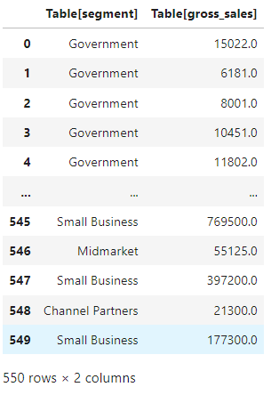
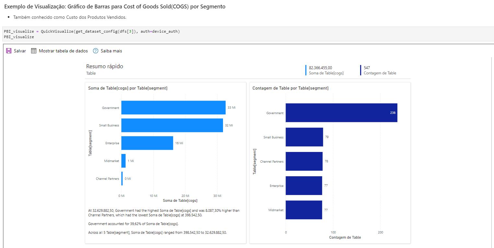
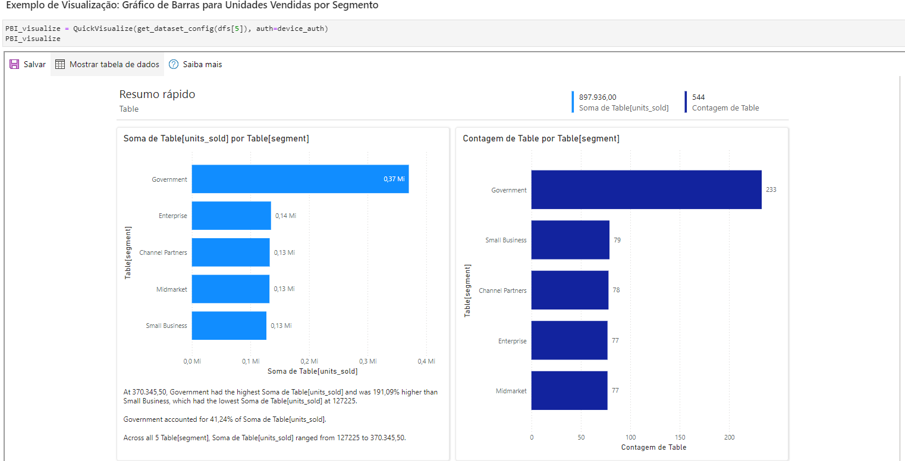

# Como Utilizar a Função DAX `SUMMARIZECOLUMNS` no Power BI para Criar KPIs Poderosos

## Introdução

O Power BI é uma ferramenta poderosa para análise e visualização de dados, amplamente utilizada por profissionais de diversas áreas para criar relatórios dinâmicos e interativos. Uma das linguagens mais importantes no Power BI é o DAX (Data Analysis Expressions), que permite a criação de fórmulas complexas para manipulação de dados. Neste artigo, focaremos na função DAX `SUMMARIZECOLUMNS`, explorando suas funcionalidades e como utilizá-la para criar KPIs valiosos. Utilizaremos o dataset `financial-sample` disponível no [data.world](https://data.world/jcnok/financial-sample) e integraremos as visualizações diretamente a partir do Jupyter Notebook usando a biblioteca `powerbiclient`.

## Fórmula DAX Escolhida: `SUMMARIZECOLUMNS`

### Principais Funcionalidades

A função `SUMMARIZECOLUMNS` é utilizada para criar tabelas resumidas, agrupando dados por colunas especificadas e realizando agregações. Ela é particularmente eficiente e otimizada para consultas DAX no Power BI.

### Sintaxe

```dax
SUMMARIZECOLUMNS (
    <GroupBy_ColumnName>,
    [<FilterTable>],
    <Name> [, <Expression>] [, <Name>, <Expression>]...
)
```

### KPIs que vamos criar usando DAX:

**KPIs por Segmento:**

1. **Vendas Brutas por Segmento:**
   Indica a receita bruta gerada por cada segmento. Importante para identificar quais segmentos são mais lucrativos.

2. **Descontos por Segmento:**
   Mostra o total de descontos aplicados por segmento. Útil para avaliar políticas de desconto.

3. **Vendas por Segmento:**
   Reflete o total de vendas líquidas após dedução de descontos. Essencial para entender a contribuição líquida de cada segmento.

4. **Cost of Goods Sold (COGS) por Segmento:**
   Exibe o custo direto dos bens vendidos por segmento. Crucial para analisar a margem de lucro e eficiência operacional em diferentes segmentos.

5. **Lucro por Segmento:**
   Demonstra o lucro líquido gerado por cada segmento após todos os custos. Importante para avaliar a rentabilidade e performance financeira de cada segmento.

6. **Unidades Vendidas por Segmento:**
   Apresenta a quantidade de unidades vendidas em cada segmento. Útil para entender a demanda e popularidade dos produtos em diferentes segmentos.


### Quando e Por Que Usar a Integração do Power BI ao Jupyter Notebook

A integração do Power BI ao Jupyter Notebook é útil para:

- **Análise Avançada**: Combinar as capacidades de análise do Python com as ferramentas de visualização do Power BI.
- **Automação de Relatórios**: Automatizar a geração de relatórios e dashboards.
- **Colaboração**: Facilitar a colaboração entre cientistas de dados e analistas de negócios.

## Antes vale a pena passar um overview das principais ferramentas que serão utilizadas:

### Plataforma data.world

A [data.world](https://data.world/) é uma plataforma colaborativa para dados e análises, que permite armazenar, compartilhar e explorar dados. Facilita a colaboração entre equipes e a integração de dados de várias fontes, promovendo insights e decisões baseadas em dados.

### Usabilidade da API data.world

A API [datadotworld](https://pypi.org/project/datadotworld/) permite acessar e manipular datasets diretamente em Python. Ela facilita a integração com ferramentas analíticas, possibilitando consultas, uploads e compartilhamento de dados. Ideal para projetos que exigem automação e análise de dados eficiente.

### Biblioteca powerbiclient

A biblioteca [powerbiclient](https://pypi.org/project/powerbiclient/) facilita a integração do Power BI com Jupyter Notebooks. Permite a inserção e interação com relatórios do Power BI diretamente em notebooks, promovendo uma análise de dados interativa e visual. Ideal para analistas de dados que desejam combinar o poder de visualização do Power BI com a flexibilidade dos notebooks Jupyter.

### API Power BI

A API Power BI permite automação e integração avançada com a plataforma Power BI. Ela possibilita criar, gerenciar e compartilhar relatórios e dashboards, além de executar consultas DAX e obter insights. Ideal para desenvolvedores que buscam automatizar processos e integrar visualizações de dados em suas aplicações, promovendo análises e decisões baseadas em dados.

## Passo a Passo: Exemplos com `SUMMARIZECOLUMNS`

Vamos criar e visualizar alguns KPIs usando a função `SUMMARIZECOLUMNS` no Jupyter Notebook.

### Configurar o Ambiente

* Certifique-se de ter as bibliotecas necessárias instaladas:

```
$ pip install jupyter pandas requests powerbiclient openpyxl datadotworld
```

* No prompt abra o jupyter lab:
```
 $ jupyter lab
``` 

### Importar as Bibliotecas


```python
import requests
import pandas as pd
import os
import datadotworld as dw
from powerbiclient.authentication import DeviceCodeLoginAuthentication
from powerbiclient import Report, models, QuickVisualize, get_dataset_config
```

### Esta biblioteca requer um token de autenticação da API data.world para funcionar.
Seu token de autenticação pode ser obtido no data.world depois que você habilitar o [Python em Integrações]('https://data.world/integrations/python')

* **Para configurar a biblioteca, execute o seguinte comando:**

$ dw configure

* Alternativamente, os tokens podem ser fornecidos por meio da variável de ambiente DW_AUTH_TOKEN . Em máquinas MacOS ou Unix, execute (substituindo <YOUR_TOKEN>> abaixo pelo token obtido anteriormente):
`export DW_AUTH_TOKEN=<YOUR_TOKEN>`

`$ export DW_AUTH_TOKEN=dw_api_token`


```python
!export DW_AUTH_TOKEN=dw_api_token
```

### Carregando o dataset via API:

* A função query() permite que conjuntos de dados sejam consultados ao vivo usando linguagens de consulta SQL ou SPARQL .

* Para consultar um conjunto de dados, invoque a função query() . Por exemplo:


```python
results = dw.query('jcnok/financial-sample', 'SELECT * FROM financial_sample')
```


```python
df = results.dataframe
df.head()
```


### Autenticação no Power BI

* Para interagir com o Power BI, você precisa autenticar sua conta. Utilizaremos a autenticação com código de dispositivo, o que torna o processo seguro e conveniente:


```python
device_auth = DeviceCodeLoginAuthentication()
token = device_auth.get_access_token()
headers = {
    'Content-Type': 'application/json',
    'Authorization': f'Bearer {token}'
}
```

    Performing device flow authentication. Please follow the instructions below.
    To sign in, use a web browser to open the page https://microsoft.com/devicelogin and enter the code AAZ8RHBUG to authenticate.
    
    Device flow authentication successfully completed.
    You are now logged in .
    
    The result should be passed only to trusted code in your notebook.


* Siga as instruções para copiar o código gerado e cole-o após acessar o link fornecido. Isso autentica sua conta do Power BI.

### Visualizando seus Dados no Power BI

Agora que seus dados estão prontos e você está autenticado, é hora de criar visualizações no Power BI. O código a seguir faz exatamente isso:


```python
PBI_visualize = QuickVisualize(get_dataset_config(df), auth=device_auth)
```

* **Renderizando o Relatório**

Agora já é possível renderizar o relatório diretamente no Jupyter Notebook:


```python
PBI_visualize
```


* QuickVisualize cria um dash rápido de forma automática, podemos alterar o tipo do gráfico e obter alguns insights simples.
* Vamos clicar em salvar e dar um nome ao relatório.


* Veja como foi simples obter os dados, visulizar um dash e salvar no powerbi.
* Agora vamos executar algumas consultas em DAX.

### Definir e Executar Consultas DAX

Defina as consultas DAX que serão utilizadas para extrair os KPIs.

* Agora precisamos obter o id do dataset que foi salvo no powerbi acesse o link: [powerbi app](https://app.powerbi.com/)
* Localize o dataset e conforme a imagem abaixo copie o id do dataset:


### Defina as consultas DAX que serão utilizadas para extrair os KPIs.


```python
# Lista de consultas DAX
dax_queries = [
    {"query": "EVALUATE SUMMARIZECOLUMNS('Table'[Segment], 'Table'[Gross_Sales])"},
    {"query": "EVALUATE SUMMARIZECOLUMNS('Table'[Segment], 'Table'[Discounts])"},
    {"query": "EVALUATE SUMMARIZECOLUMNS('Table'[Segment], 'Table'[Sales])"},
    {"query": "EVALUATE SUMMARIZECOLUMNS('Table'[Segment], 'Table'[COGS])"},
    {"query": "EVALUATE SUMMARIZECOLUMNS('Table'[Segment], 'Table'[Profit])"},
    {"query": "EVALUATE SUMMARIZECOLUMNS('Table'[Segment], 'Table'[Units_Sold])"}    
]
```

### Aplicando as DAX queries e salvando em juntando em um único dataframe.


```python
# link da api e id do dataset.
dataset_id = 'edf35402-a994-4111-b4a3-65b644fb25de' 
url = f'https://api.powerbi.com/v1.0/myorg/datasets/{dataset_id}/executeQueries'
```


```python
# Função para executar consultas DAX e retornar DataFrame
def execute_dax_query(dax_query, headers, url):
    response = requests.post(url, headers=headers, json={"queries": [dax_query], "serializerSettings": {"includeNulls": True}})
    response_data = response.json()
    results = response_data['results'][0]['tables'][0]['rows']
    df = pd.DataFrame(results)
    return df

# Executar consultas e realizando o join dos resultados
dfs = []
for dax_query in dax_queries:
    df = execute_dax_query(dax_query, headers, url)
    dfs.append(df)
```


```python
# Visualizando uma das consultas salvas.
dfs[0]
```



### Agora podemos Visualizar os Resultados:

Vamos utilizar biblioteca `QuickVisualize` para criar visualizações com Power BI.

#### Exemplo de Visualização: Gráfico de Barras para Vendas Brutas por Segmento

PBI_visualize = QuickVisualize(get_dataset_config(dfs[0]), auth=device_auth)
PBI_visualize


#### Exemplo de Visualização: Gráfico de Barras para Descontos por Segmento


```python
PBI_visualize = QuickVisualize(get_dataset_config(dfs[1]), auth=device_auth)
PBI_visualize
```


#### Exemplo de Visualização: Gráfico de Barras para Vendas por Segmento


```python
PBI_visualize = QuickVisualize(get_dataset_config(dfs[2]), auth=device_auth)
PBI_visualize
```


#### Exemplo de Visualização: Gráfico de Barras para Cost of Goods Sold(COGS) por Segmento


```python
PBI_visualize = QuickVisualize(get_dataset_config(dfs[3]), auth=device_auth)
PBI_visualize
```



#### Exemplo de Visualização: Gráfico de Barras para Lucro por Segmento


```python
PBI_visualize = QuickVisualize(get_dataset_config(dfs[4]), auth=device_auth)
PBI_visualize
```


#### Exemplo de Visualização: Gráfico de Barras para Unidades Vendidas por Segmento


```python
PBI_visualize = QuickVisualize(get_dataset_config(dfs[5]), auth=device_auth)
PBI_visualize
```



### Conclusão

Neste artigo, exploramos a função DAX `SUMMARIZECOLUMNS` e como utilizá-la para criar KPIs no Power BI. Demonstramos como executar consultas DAX diretamente no Jupyter Notebook e integrar visualizações ao Power BI, proporcionando uma abordagem eficiente para análises avançadas e visualização de dados. Aproveite essas técnicas para melhorar suas habilidades em Power BI e criar dashboards cada vez mais sofisticados e informativos.

### Recursos Adicionais

- [Documentação Oficial do Power BI](https://docs.microsoft.com/power-bi/)
- [Tutoriais de DAX](https://docs.microsoft.com/dax/)
- [Biblioteca powerbiclient](https://pypi.org/project/powerbiclient/)


```python

```
